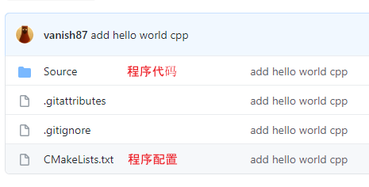

# Game Programming 101

## Tools

- Github: https://github.com/vanish87/vEngine
  - 网页形式的代码浏览工具
  - 保存代码
  - 在线合作讨论：https://github.com/vanish87/vEngine/discussions
- cmake：https://cmake.org/
  - 配置项目的工具

### 基本概念

- 代码（Source Code）：以.cpp、.h结尾的文件，是程序的主要部分

- 配置：使用cmake决定哪些代码文件需要编译
- 编译(Compile)：把代码转换为可以执行的程序

- Source文件夹存放了所有的代码文件

- CMakeLists.txt是项目的配置文件

  

- 进入[main.cpp](https://github.com/vanish87/vEngine/blob/master/Source/main.cpp)可以看到程序的内容如下

  ```cpp
  #include <iostream>
  
  //以'//'开头的是注释，在程序执行中并不起作用
  //main表示程序从这里开始，逐行执行
  //{ }之间的代码，就是main内容
  int main(int argc, char* argv[])
  {
      //std::cout表示把"Hello World"显示在屏幕上
      std::cout << "Hello World";
  	//return表示main结束
      return 0;
  }
  ```

- 进入[CmakeList.txt](https://github.com/vanish87/vEngine/blob/master/CMakeLists.txt)可以看到程序配置如下

  ```cmake
  # 以'#'开头的是注释，在程序执行中并不起作用
  # cmake minium version required
  cmake_minimum_required(VERSION 3.13)
  
  # project name
  project(vEngine)
  
  # c++ setting
  set(CMAKE_CXX_STANDARD 11)
  
  # compile main.cpp as exe
  add_executable(vEngine Source/main.cpp)
  ```

  